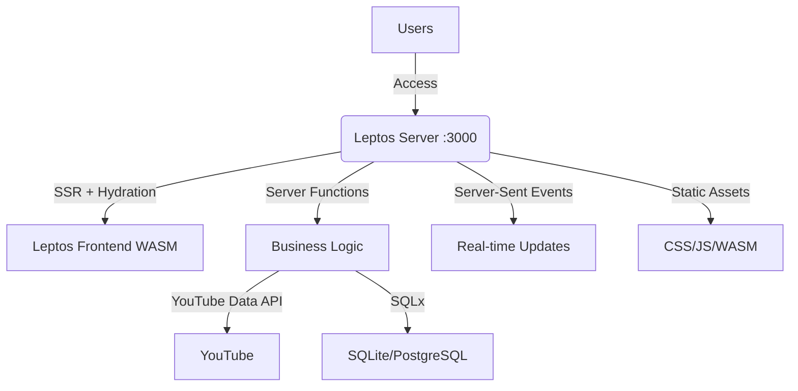

# YouTube Together WebApp Development Plan

## 1. Requirements Analysis and System Architecture Design

### 1.1. Functional Requirements

-   **Single Shared Room:**

    -   All users access one unified shared room
    -   Users only need to enter their name to join the room

-   **YouTube Video/Music Synchronization:**

    -   All users in the room watch/listen to the same YouTube video/song
    -   Synchronize playback state (play/pause) and current video time
    -   When one user changes playback state or seeks the video, that state is synchronized to all other users in the room

-   **Queue Management:**

    -   Users can add YouTube videos/songs to the room's queue
    -   Queue displays the list of videos/songs to be played next
    -   Users can reorder the queue (e.g., drag and drop)
    -   Users can remove videos from the queue

-   **Chat System:**

    -   Users in the room can chat with each other through text messages
    -   Support sending YouTube links directly in chat to add to queue

-   **User Management:**
    -   Display list of current users in the room
    -   May have roles (e.g., room owner has queue management privileges, kick users)

### 1.2. Non-Functional Requirements

-   **Performance:** System must handle multiple concurrent users without lag
-   **Reliability:** Ensure accurate playback state synchronization between users
-   **Security:** Protect user information and room data
-   **Scalability:** System architecture must be easily scalable as user count increases
-   **Technology Stack:**
    -   Fullstack: Leptos.dev (Rust)
    -   Database: SQLx with SQLite/PostgreSQL
    -   Real-time communication: Server-Sent Events (SSE)
    -   CSS Framework: Tailwind CSS
    -   Single Binary Deployment: All services compiled into one binary

### 1.3. System Architecture Overview

The system architecture uses Leptos.dev fullstack framework with the following components:

1. **Leptos Frontend:** Client-side reactive UI with WebAssembly
2. **Leptos Backend:** Server-side rendering and API endpoints using Axum
3. **Real-time Communication:** Server-Sent Events for live updates
4. **Database Layer:** SQLx with SQLite for development, PostgreSQL for production



**Architecture Details:**

-   **Leptos Server:** Handles both SSR and API endpoints using Axum backend
-   **Server Functions:** Type-safe RPC-style communication between frontend and backend
-   **Hydration:** Server-rendered pages become interactive on the client
-   **WASM Frontend:** Fast, reactive UI compiled from Rust to WebAssembly
-   **SSE:** Server-Sent Events for real-time synchronization
-   **Single Binary:** Everything compiles to one executable

## 2. Database Schema and Server Functions Design

### 2.1. Database Schema

The system uses SQLx with either SQLite (development) or PostgreSQL (production):

#### 2.1.1. Users Table

```sql
CREATE TABLE users (
    id TEXT PRIMARY KEY,                 -- User UUID
    username TEXT NOT NULL,              -- Display name
    is_online BOOLEAN DEFAULT TRUE,      -- Online status
    joined_at TIMESTAMP DEFAULT CURRENT_TIMESTAMP,
    last_seen TIMESTAMP DEFAULT CURRENT_TIMESTAMP
);
```

#### 2.1.2. Queue Table

```sql
CREATE TABLE queue (
    id INTEGER PRIMARY KEY AUTOINCREMENT,
    video_id TEXT NOT NULL,              -- YouTube video ID
    video_url TEXT NOT NULL,             -- YouTube video URL
    video_title TEXT,                    -- Video title
    video_duration INTEGER,              -- Video duration (seconds)
    video_thumbnail TEXT,                -- Thumbnail URL
    added_by TEXT NOT NULL,              -- User ID who added video
    position INTEGER NOT NULL,           -- Position in queue
    added_at TIMESTAMP DEFAULT CURRENT_TIMESTAMP,
    FOREIGN KEY (added_by) REFERENCES users(id) ON DELETE CASCADE
);
```

#### 2.1.3. Messages Table

```sql
CREATE TABLE messages (
    id INTEGER PRIMARY KEY AUTOINCREMENT,
    user_id TEXT NOT NULL,               -- Sender ID
    username TEXT NOT NULL,              -- Sender name (to avoid joins)
    content TEXT NOT NULL,               -- Message content
    message_type TEXT DEFAULT 'text',    -- Message type: 'text', 'video_link', 'system'
    created_at TIMESTAMP DEFAULT CURRENT_TIMESTAMP,
    FOREIGN KEY (user_id) REFERENCES users(id) ON DELETE CASCADE
);
```

#### 2.1.4. Room State Table

```sql
CREATE TABLE room_state (
    id INTEGER PRIMARY KEY DEFAULT 1,    -- Always 1 since only one room
    current_video_id TEXT,               -- Current YouTube video ID
    current_video_url TEXT,              -- Current YouTube video URL
    current_video_title TEXT,            -- Current video title
    current_video_duration INTEGER,      -- Video duration (seconds)
    current_position REAL,               -- Current video position (seconds)
    is_playing BOOLEAN DEFAULT FALSE,    -- Video playback state
    last_updated TIMESTAMP DEFAULT CURRENT_TIMESTAMP
);
```

### 2.2. Leptos Server Functions

#### 2.2.1. User Management Server Functions

```rust
// Server function for joining the room
#[server(JoinRoom, "/api")]
pub async fn join_room(username: String) -> Result<JoinResponse, ServerFnError> {
    use crate::state::AppState;

    let app_state = expect_context::<AppState>();
    let user_id = uuid::Uuid::new_v4().to_string();

    // Insert user into database
    sqlx::query!(
        "INSERT INTO users (id, username) VALUES (?, ?)",
        user_id,
        username
    )
    .execute(&app_state.db)
    .await?;

    // Get current room state
    let room_state = get_room_state().await?;

    Ok(JoinResponse {
        user_id,
        username,
        room_state,
    })
}

#[server(GetRoomState, "/api")]
pub async fn get_room_state() -> Result<RoomState, ServerFnError> {
    let app_state = expect_context::<AppState>();

    let current_video = sqlx::query_as!(
        VideoState,
        "SELECT * FROM room_state WHERE id = 1"
    )
    .fetch_optional(&app_state.db)
    .await?;

    let queue = sqlx::query_as!(
        QueueItem,
        "SELECT * FROM queue ORDER BY position"
    )
    .fetch_all(&app_state.db)
    .await?;

    let users = sqlx::query_as!(
        User,
        "SELECT * FROM users WHERE is_online = TRUE"
    )
    .fetch_all(&app_state.db)
    .await?;

    let messages = sqlx::query_as!(
        Message,
        "SELECT * FROM messages ORDER BY created_at DESC LIMIT 50"
    )
    .fetch_all(&app_state.db)
    .await?;

    Ok(RoomState {
        current_video,
        queue,
        users,
        messages,
    })
}
```

#### 2.2.2. Video Control Server Functions

```rust
#[server(PlayVideo, "/api")]
pub async fn play_video(user_id: String, position: f64) -> Result<(), ServerFnError> {
    let app_state = expect_context::<AppState>();

    // Update room state
    sqlx::query!(
        "UPDATE room_state SET is_playing = TRUE, current_position = ?, last_updated = CURRENT_TIMESTAMP WHERE id = 1",
        position
    )
    .execute(&app_state.db)
    .await?;

    // Broadcast event
    app_state.broadcast_event(Event {
        event_type: "video_state_changed".to_string(),
        data: serde_json::json!({
            "is_playing": true,
            "position": position,
            "updated_by": user_id
        }),
        timestamp: chrono::Utc::now().timestamp_millis(),
    }).await;

    Ok(())
}

#[server(PauseVideo, "/api")]
pub async fn pause_video(user_id: String, position: f64) -> Result<(), ServerFnError> {
    let app_state = expect_context::<AppState>();

    sqlx::query!(
        "UPDATE room_state SET is_playing = FALSE, current_position = ?, last_updated = CURRENT_TIMESTAMP WHERE id = 1",
        position
    )
    .execute(&app_state.db)
    .await?;

    app_state.broadcast_event(Event {
        event_type: "video_state_changed".to_string(),
        data: serde_json::json!({
            "is_playing": false,
            "position": position,
            "updated_by": user_id
        }),
        timestamp: chrono::Utc::now().timestamp_millis(),
    }).await;

    Ok(())
}

#[server(SeekVideo, "/api")]
pub async fn seek_video(user_id: String, position: f64) -> Result<(), ServerFnError> {
    let app_state = expect_context::<AppState>();

    sqlx::query!(
        "UPDATE room_state SET current_position = ?, last_updated = CURRENT_TIMESTAMP WHERE id = 1",
        position
    )
    .execute(&app_state.db)
    .await?;

    app_state.broadcast_event(Event {
        event_type: "video_state_changed".to_string(),
        data: serde_json::json!({
            "position": position,
            "updated_by": user_id
        }),
        timestamp: chrono::Utc::now().timestamp_millis(),
    }).await;

    Ok(())
}
```

#### 2.2.3. Queue Management Server Functions

```rust
#[server(AddToQueue, "/api")]
pub async fn add_to_queue(user_id: String, video_url: String) -> Result<(), ServerFnError> {
    let app_state = expect_context::<AppState>();

    // Extract video ID and fetch metadata from YouTube API
    let video_id = extract_youtube_id(&video_url)?;
    let video_info = fetch_youtube_info(&video_id).await?;

    // Get next position
    let next_position: i32 = sqlx::query_scalar!(
        "SELECT COALESCE(MAX(position), 0) + 1 FROM queue"
    )
    .fetch_one(&app_state.db)
    .await?;

    // Insert into queue
    sqlx::query!(
        "INSERT INTO queue (video_id, video_url, video_title, video_duration, video_thumbnail, added_by, position) VALUES (?, ?, ?, ?, ?, ?, ?)",
        video_id,
        video_url,
        video_info.title,
        video_info.duration,
        video_info.thumbnail,
        user_id,
        next_position
    )
    .execute(&app_state.db)
    .await?;

    // Broadcast queue update
    app_state.broadcast_event(Event {
        event_type: "queue_updated".to_string(),
        data: serde_json::json!({"action": "added"}),
        timestamp: chrono::Utc::now().timestamp_millis(),
    }).await;

    Ok(())
}

#[server(RemoveFromQueue, "/api")]
pub async fn remove_from_queue(user_id: String, queue_id: i32) -> Result<(), ServerFnError> {
    let app_state = expect_context::<AppState>();

    sqlx::query!(
        "DELETE FROM queue WHERE id = ?",
        queue_id
    )
    .execute(&app_state.db)
    .await?;

    app_state.broadcast_event(Event {
        event_type: "queue_updated".to_string(),
        data: serde_json::json!({"action": "removed"}),
        timestamp: chrono::Utc::now().timestamp_millis(),
    }).await;

    Ok(())
}
```

#### 2.2.4. Chat Server Functions

```rust
#[server(SendMessage, "/api")]
pub async fn send_message(user_id: String, username: String, content: String) -> Result<(), ServerFnError> {
    let app_state = expect_context::<AppState>();

    // Insert message
    sqlx::query!(
        "INSERT INTO messages (user_id, username, content) VALUES (?, ?, ?)",
        user_id,
        username,
        content
    )
    .execute(&app_state.db)
    .await?;

    // Broadcast message
    app_state.broadcast_event(Event {
        event_type: "message_sent".to_string(),
        data: serde_json::json!({
            "user_id": user_id,
            "username": username,
            "content": content,
            "timestamp": chrono::Utc::now().timestamp_millis()
        }),
        timestamp: chrono::Utc::now().timestamp_millis(),
    }).await;

    Ok(())
}

#[server(GetMessages, "/api")]
pub async fn get_messages(limit: Option<i32>, offset: Option<i32>) -> Result<Vec<Message>, ServerFnError> {
    let app_state = expect_context::<AppState>();
    let limit = limit.unwrap_or(50);
    let offset = offset.unwrap_or(0);

    let messages = sqlx::query_as!(
        Message,
        "SELECT * FROM messages ORDER BY created_at DESC LIMIT ? OFFSET ?",
        limit,
        offset
    )
    .fetch_all(&app_state.db)
    .await?;

    Ok(messages)
}
```

## 3. Implementation Plan

### 3.1. Tech Stack and Dependencies

#### 3.1.1. Cargo.toml

```toml
[package]
name = "youtube-together"
version = "0.1.0"
edition = "2021"

[lib]
crate-type = ["cdylib"]

[[bin]]
name = "server"
required-features = ["ssr"]

[dependencies]
leptos = { version = "0.6", features = ["nightly"] }
leptos_meta = { version = "0.6", features = ["nightly"] }
leptos_router = { version = "0.6", features = ["nightly"] }
leptos_axum = { version = "0.6", optional = true }

# Server-side dependencies
axum = { version = "0.7", optional = true }
tokio = { version = "1", features = ["full"], optional = true }
tower = { version = "0.4", optional = true }
tower-http = { version = "0.5", features = ["fs"], optional = true }
sqlx = { version = "0.7", features = ["runtime-tokio-rustls", "sqlite", "chrono", "uuid"], optional = true }
serde = { version = "1", features = ["derive"] }
serde_json = "1"
uuid = { version = "1", features = ["v4", "serde"] }
chrono = { version = "0.4", features = ["serde"] }
reqwest = { version = "0.11", features = ["json"], optional = true }
dotenv = { version = "0.15", optional = true }
tracing = { version = "0.1", optional = true }
tracing-subscriber = { version = "0.3", optional = true }

# Client-side dependencies
console_error_panic_hook = "0.1"
console_log = "1"
wasm-bindgen = "0.2"
web-sys = { version = "0.3", features = [
    "console",
    "Window",
    "Document",
    "Element",
    "HtmlElement",
    "EventSource",
    "MessageEvent",
] }
gloo-timers = { version = "0.3", features = ["futures"] }

[features]
hydrate = ["leptos/hydrate", "leptos_meta/hydrate", "leptos_router/hydrate"]
ssr = [
    "dep:axum",
    "dep:tokio",
    "dep:tower",
    "dep:tower-http",
    "dep:leptos_axum",
    "dep:sqlx",
    "dep:reqwest",
    "dep:dotenv",
    "dep:tracing",
    "dep:tracing-subscriber",
    "leptos/ssr",
    "leptos_meta/ssr",
    "leptos_router/ssr",
]

[package.metadata.leptos]
output-name = "youtube-together"
site-root = "target/site"
site-pkg-dir = "pkg"
assets-dir = "public"
style-file = "style/main.scss"
tailwind-input-file = "style/tailwind.css"
bin-features = ["ssr"]
bin-default-features = false
lib-features = ["hydrate"]
lib-default-features = false
```

### 3.2. Project Structure

```
youtube-together/
├── src/
│   ├── lib.rs                   # Main app component
│   │   ├── mod.rs
│   │   ├── video_player.rs      # YouTube player component
│   │   ├── queue.rs             # Queue management
│   │   ├── chat.rs              # Chat interface
│   │   ├── user_list.rs         # Online users
│   │   └── join_modal.rs        # Join room modal
│   │
│   ├── main.rs                  # Server entry point
│   ├── pages/
│   │   ├── mod.rs
│   │   └── home.rs              # Main room page
│   │
│   ├── server/
│   │   ├── mod.rs
│   │   ├── functions.rs         # Server functions
│   │   ├── state.rs             # Application state
│   │   ├── database.rs          # Database operations
│   │   ├── youtube.rs           # YouTube API integration
│   │   └── events.rs            # SSE event handling
│   │
│   └── types/
│       ├── mod.rs
│       └── models.rs            # Shared data types
│
├── style/
│   ├── main.scss
│   └── tailwind.css
│
├── public/
│   └── favicon.ico
│
├── migrations/
│   ├── 001_initial.sql
│   └── 002_indexes.sql
│
├── Cargo.toml
│
└── .env
```

### 3.3. Main Application Structure

#### 3.3.1. lib.rs - Main App Component

```rust
use leptos::*;
use leptos_meta::*;
use leptos_router::*;

mod components;
mod pages;
mod types;

#[cfg(feature = "ssr")]
pub mod server;

use crate::pages::Home;

#[component]
pub fn App() -> impl IntoView {
    provide_meta_context();

    view! {
        <Stylesheet id="leptos" href="/pkg/youtube-together.css"/>
        <Title text="YouTube Together"/>
        <Meta name="description" content="Watch YouTube videos together in real-time"/>

        <Router>
            <main class="min-h-screen bg-gray-900 text-white">
                <Routes>
                    <Route path="" view=Home/>
                </Routes>
            </main>
        </Router>
    }
}
```

#### 3.3.2. main.rs - Server Entry Point

```rust
#[cfg(feature = "ssr")]
#[tokio::main]
async fn main() {
    use axum::Router;
    use leptos::*;
    use leptos_axum::{generate_route_list, LeptosRoutes};
    use tower_http::services::ServeDir;
    use youtube_together::*;
    use youtube_together::server::state::AppState;

    // Initialize tracing
    tracing_subscriber::init();

    // Load environment variables
    dotenv::dotenv().ok();

    // Initialize application state
    let app_state = AppState::new().await.expect("Failed to initialize app state");

    // Generate routes list
    let conf = get_configuration(None).await.unwrap();
    let leptos_options = conf.leptos_options;
    let addr = leptos_options.site_addr;
    let routes = generate_route_list(App);

    // Build the Axum router
    let app = Router::new()
        .leptos_routes_with_context(
            &leptos_options,
            routes,
            move || provide_context(app_state.clone()),
            App,
        )
        .fallback(leptos_axum::file_and_error_handler(handler_404))
        .nest_service("/events", app_state.event_handler())
        .nest_service("/pkg", ServeDir::new("target/site/pkg"))
        .nest_service("/public", ServeDir::new("public"))
        .with_state(app_state);

    // Start the server
    let listener = tokio::net::TcpListener::bind(&addr).await.unwrap();
    tracing::info!("listening on http://{}", &addr);
    axum::serve(listener, app.into_make_service())
        .await
        .unwrap();
}

#[cfg(not(feature = "ssr"))]
pub fn main() {
    // This is required when building for WASM
}

#[cfg(feature = "ssr")]
async fn handler_404() -> axum::response::Response<axum::body::Body> {
    use axum::http::StatusCode;
    use axum::response::Html;

    (StatusCode::NOT_FOUND, Html("<h1>404 - Page Not Found</h1>")).into_response()
}
```

#### 3.3.3. Server State Management

```rust
// src/server/state.rs
use std::sync::Arc;
use sqlx::{SqlitePool, Pool, Sqlite};
use tokio::sync::broadcast;
use serde::{Serialize, Deserialize};

#[derive(Clone)]
pub struct AppState {
    pub db: Pool<Sqlite>,
    pub event_sender: broadcast::Sender<Event>,
}

#[derive(Debug, Clone, Serialize, Deserialize)]
pub struct Event {
    pub event_type: String,
    pub data: serde_json::Value,
    pub timestamp: i64,
}

impl AppState {
    pub async fn new() -> Result<Self, Box<dyn std::error::Error>> {
        let database_url = std::env::var("DATABASE_URL")
            .unwrap_or_else(|_| "sqlite:./database.db".to_string());

        let db = SqlitePool::connect(&database_url).await?;

        // Run migrations
        sqlx::migrate!("./migrations").run(&db).await?;

        let (event_sender, _) = broadcast::channel(1000);

        Ok(Self {
            db,
            event_sender,
        })
    }

    pub async fn broadcast_event(&self, event: Event) {
        let _ = self.event_sender.send(event);
    }

    pub fn event_handler(&self) -> axum::Router {
        use axum::{
            response::sse::{Event as SseEvent, KeepAlive, Sse},
            response::Response,
            routing::get,
        };
        use futures::stream::{self, Stream};
        use std::convert::Infallible;

        let sender = self.event_sender.clone();

        axum::Router::new().route(
            "/",
            get(|| async move {
                let rx = sender.subscribe();
                let stream = stream::unfold(rx, |mut rx| async move {
                    match rx.recv().await {
                        Ok(event) => {
                            let json = serde_json::to_string(&event).unwrap_or_default();
                            Some((
                                Ok::<_, Infallible>(
                                    SseEvent::default()
                                        .event(&event.event_type)
                                        .data(json)
                                ),
                                rx,
                            ))
                        }
                        Err(_) => None,
                    }
                });

                Sse::new(stream).keep_alive(KeepAlive::default())
            }),
        )
    }
}
```

### 3.4. Frontend Components

#### 3.4.1. Video Player Component

```rust
// src/components/video_player.rs
use leptos::*;
use wasm_bindgen::prelude::*;

#[component]
pub fn VideoPlayer(
    video_id: ReadSignal<Option<String>>,
    is_playing: ReadSignal<bool>,
    current_position: ReadSignal<f64>,
    on_play: impl Fn(f64) + 'static,
    on_pause: impl Fn(f64) + 'static,
    on_seek: impl Fn(f64) + 'static,
) -> impl IntoView {
    let player_ref = create_node_ref::<html::Div>();

    // YouTube player setup effect
    create_effect(move |_| {
        if let Some(video_id) = video_id.get() {
            // Initialize YouTube player
            spawn_local(async move {
                setup_youtube_player(&video_id, player_ref).await;
            });
        }
    });

    view! {
        <div class="relative w-full aspect-video bg-black rounded-lg overflow-hidden">
            <div
                node_ref=player_ref
                id="youtube-player"
                class="w-full h-full"
            />

            <div class="absolute bottom-4 left-4 right-4 flex items-center gap-4 bg-black/50 rounded p-3">
                <button
                    class="px-4 py-2 bg-red-600 text-white rounded hover:bg-red-700"
                    on:click=move |_| {
                        if is_playing.get() {
                            on_pause(get_current_time());
                        } else {
                            on_play(get_current_time());
                        }
                    }
                >
                    {move || if is_playing.get() { "⏸️" } else { "▶️" }}
                </button>

                <div class="flex-1">
                    <div class="text-sm text-white">
                        {move || format!("Position: {:.1}s", current_position.get())}
                    </div>
                </div>
            </div>
        </div>
    }
}

// YouTube player integration
#[wasm_bindgen]
extern "C" {
    #[wasm_bindgen(js_namespace = YT)]
    type Player;

    #[wasm_bindgen(constructor, js_namespace = YT)]
    fn new(element_id: &str, options: &JsValue) -> Player;

    #[wasm_bindgen(method)]
    fn playVideo(this: &Player);

    #[wasm_bindgen(method)]
    fn pauseVideo(this: &Player);

    #[wasm_bindgen(method)]
    fn seekTo(this: &Player, seconds: f64);

    #[wasm_bindgen(method)]
    fn getCurrentTime(this: &Player) -> f64;
}

async fn setup_youtube_player(video_id: &str, player_ref: NodeRef<html::Div>) {
    // YouTube IFrame API setup
    // This would include the actual YouTube player initialization
}

fn get_current_time() -> f64 {
    // Get current time from YouTube player
    0.0
}
```

#### 3.4.2. Real-time Event Handling

```rust
// src/components/event_listener.rs
use leptos::*;
use wasm_bindgen::prelude::*;
use web_sys::{EventSource, MessageEvent};

#[component]
pub fn EventListener(
    on_event: impl Fn(String, serde_json::Value) + 'static + Clone,
) -> impl IntoView {
    let (connection_status, set_connection_status) = create_signal("Disconnected".to_string());

    create_effect(move |_| {
        let on_event = on_event.clone();
        spawn_local(async move {
            let event_source = EventSource::new("/events").unwrap();
            set_connection_status.set("Connected".to_string());

            let onmessage_callback = Closure::wrap(Box::new(move |e: MessageEvent| {
                if let Ok(data) = e.data().as_string() {
                    if let Ok(event) = serde_json::from_str::<serde_json::Value>(&data) {
                        if let (Some(event_type), Some(event_data)) = (
                            event.get("event_type").and_then(|v| v.as_str()),
                            event.get("data")
                        ) {
                            on_event(event_type.to_string(), event_data.clone());
                        }
                    }
                }
            }) as Box<dyn FnMut(_)>);

            event_source.set_onmessage(Some(onmessage_callback.as_ref().unchecked_ref()));
            onmessage_callback.forget();
        });
    });

    view! {
        <div class="fixed top-4 right-4 px-3 py-1 text-xs rounded bg-gray-800 text-white">
            "Status: " {connection_status}
        </div>
    }
}
```

### 3.5. Development Phases

#### Phase 1: Project Setup (Week 1)

-   [ ] Initialize Leptos project with proper configuration
-   [ ] Setup SQLx database integration
-   [ ] Create basic project structure
-   [ ] Setup Tailwind CSS integration
-   [ ] Database migrations

#### Phase 2: Basic Server Functions (Week 2)

-   [ ] Implement user join functionality
-   [ ] Basic room state management
-   [ ] Server-Sent Events infrastructure
-   [ ] Authentication middleware

#### Phase 3: Video Player Integration (Week 3-4)

-   [ ] YouTube IFrame API integration in WASM
-   [ ] Video control server functions
-   [ ] Real-time video synchronization
-   [ ] YouTube API metadata fetching

#### Phase 4: Queue Management (Week 5-6)

-   [ ] Queue CRUD server functions
-   [ ] Queue UI components
-   [ ] Drag and drop functionality
-   [ ] Auto-play next video

#### Phase 5: Chat System (Week 7-8)

-   [ ] Chat server functions
-   [ ] Real-time chat UI
-   [ ] Message history
-   [ ] YouTube link detection

#### Phase 6: Polish & Deploy (Week 9-10)

-   [ ] UI/UX improvements with Tailwind
-   [ ] Performance optimization
-   [ ] Error handling
-   [ ] Production deployment

## 4. Deployment Strategy

### 4.1. Single Binary Deployment

```dockerfile
# Dockerfile
FROM rust:1.75 as builder

# Install trunk for building the frontend
RUN cargo install trunk
RUN rustup target add wasm32-unknown-unknown

WORKDIR /app
COPY . .

# Build the application
RUN trunk build --release
RUN cargo build --release --bin server --features ssr

FROM debian:bookworm-slim
RUN apt-get update && apt-get install -y \
    ca-certificates \
    sqlite3 \
    && rm -rf /var/lib/apt/lists/*

WORKDIR /app

# Copy the binary and static files
COPY --from=builder /app/target/release/server ./
COPY --from=builder /app/target/site ./target/site
COPY --from=builder /app/public ./public
COPY --from=builder /app/migrations ./migrations

EXPOSE 3000

CMD ["./server"]
```

### 4.2. Environment Configuration

```bash
# .env
DATABASE_URL=sqlite:./database.db
YOUTUBE_API_KEY=your_youtube_api_key_here
RUST_LOG=info
LEPTOS_SITE_ADDR=0.0.0.0:3000
LEPTOS_SITE_ROOT=target/site
```

### 4.3. Build Script

```bash
#!/bin/bash
# build.sh

echo "Installing dependencies..."
cargo install trunk
rustup target add wasm32-unknown-unknown

echo "Building frontend..."
trunk build --release

echo "Building backend..."
cargo build --release --bin server --features ssr

echo "Build complete! Run with: ./target/release/server"
```

## 5. Testing Strategy

### 5.1. Server Function Testing

```rust
#[cfg(test)]
mod tests {
    use super::*;
    use leptos::*;

    #[tokio::test]
    async fn test_join_room() {
        // Setup test database
        let app_state = AppState::new_test().await;
        provide_context(app_state);

        // Test joining room
        let result = join_room("TestUser".to_string()).await;
        assert!(result.is_ok());
    }

    #[tokio::test]
    async fn test_video_controls() {
        // Test video play/pause functionality
    }
}
```

### 5.2. Component Testing

```rust
#[cfg(test)]
mod component_tests {
    use super::*;
    use leptos::*;

    #[test]
    fn test_video_player_component() {
        // Test component rendering and behavior
    }
}
```

## 6. Security Considerations

### 6.1. Input Validation

-   Server function parameter validation
-   YouTube URL sanitization
-   SQL injection prevention with SQLx
-   Rate limiting on server functions

### 6.2. Authentication

-   Simple token-based authentication
-   CSRF protection built into Leptos
-   Secure session management

### 6.3. Data Protection

-   Environment variable security
-   Database security with SQLx
-   CORS configuration

## 7. Performance Optimization

### 7.1. Frontend Optimization

-   WASM bundle optimization
-   Code splitting with Leptos
-   Efficient reactive updates
-   Lazy loading components

### 7.2. Backend Optimization

-   SQLx connection pooling
-   Efficient server functions
-   Database query optimization
-   SSE connection management

### 7.3. Build Optimization

-   Release mode compilation
-   Asset optimization with trunk
-   WASM size optimization

## 8. Monitoring and Maintenance

### 8.1. Logging

-   Structured logging with tracing
-   Error tracking
-   Performance metrics
-   Database operation monitoring

### 8.2. Health Checks

-   Server health endpoint
-   Database connectivity check
-   YouTube API status monitoring

### 8.3. Backup Strategy

-   SQLite database backups
-   Configuration backups
-   Disaster recovery plan

## 9. Future Enhancements

### 9.1. Advanced Features

-   Multiple rooms support
-   User accounts with authentication
-   Video history and favorites
-   Mobile responsive design
-   Progressive Web App features

### 9.2. Scalability Improvements

-   PostgreSQL for production
-   Redis for session storage
-   Load balancing support
-   Microservices architecture

### 9.3. Additional Integrations

-   Spotify integration
-   Twitch support
-   Discord bot
-   Social media sharing

## 10. Conclusion

This updated plan leverages Leptos.dev fullstack framework to create a modern, performant YouTube Together WebApp. The architecture provides several key advantages:

**Key Benefits:**

-   **Full Rust Stack:** Type safety from frontend to backend
-   **Single Binary Deployment:** Simplified deployment and distribution
-   **Modern Architecture:** Leptos provides excellent developer experience
-   **Performance:** WASM frontend with efficient server-side rendering
-   **Real-time Features:** Server-Sent Events for live synchronization
-   **Type Safety:** Shared types between frontend and backend
-   **Developer Experience:** Hot reloading and excellent tooling

**Leptos Advantages:**

-   **Server Functions:** Type-safe RPC-style communication
-   **SSR + Hydration:** Fast initial loads with client-side interactivity
-   **Reactive System:** Efficient DOM updates
-   **WASM Performance:** Near-native performance in the browser
-   **Unified Codebase:** Single language and shared logic

The 10-week development timeline is optimized for Leptos development patterns, allowing for rapid iteration while maintaining code quality and performance standards.
